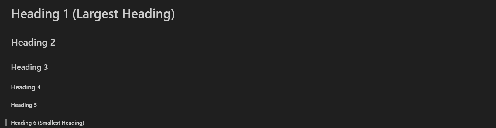
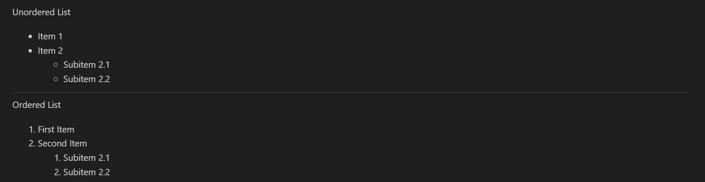
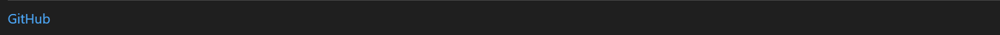
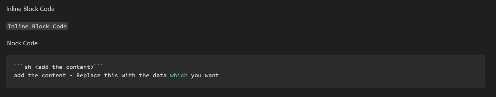
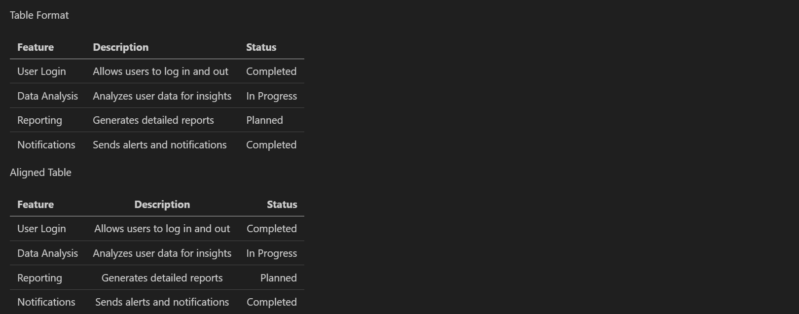
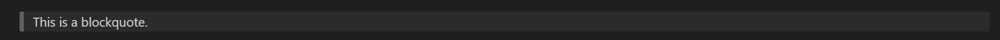
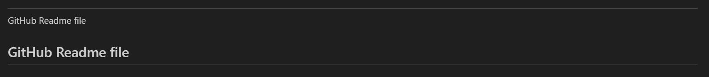
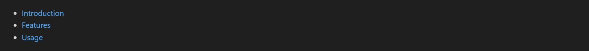

## GitHub README Markdown Cheat Sheet

### Introduction

This document provides a quick reference for using Markdown syntax within GitHub README files. Markdown is a lightweight markup language that allows you to format text, create lists, add code blocks, and structure your documentation in a clear and readable way. This guide includes common Markdown elements and examples to help you effectively create and maintain your GitHub project documentation.

### Table of Contents

- [Heading](#heading)
- [Text-Formatting](#text-formatting)
- [Lists](#lists)
- [Links](#links)
- [Images](#images)
- [Code-Blocks](#code-blocks)
- [Table](#table)
- [Blockquotes](#blockquotes)
- [Horizontal-Line](#horizontal-line)
- [Mentioning-Users](#mentioning-users)
- [Contents](#contents)

## Basic Syntax

### Heading

Headings are used to organize the information at various levels.  Markdown supports six levels of headers, with "#" being the largest and "######" representing the smallest.  Headings promote readability and allow users to easily browse the article.  They are widely used in README files to organize distinct sections, as well as for titles and subtitles.

```sh
# Heading 1  (Largest Heading)
## Heading 2
### Heading 3
#### Heading 4
##### Heading 5
###### Heading 6 (Smallest Heading)
```
Example output



### Text-Formatting

Markdown offers a range of formatting choices for text to improve readability and highlight key information.  Strikethrough, bold, italics, and a mix of these formatting options are available.  Important information is highlighted and the document is made more aesthetically pleasing with the use of text formatting.

```sh
**Bold Text**  
*Italic Text*  
~~Strikethrough~~  
**_Bold & Italic_** or ***Bold & Italic*** or ___Bold & Italic___
```
Example output


### Lists

Lists help to organize content in an organized manner.  They can be arranged (numbered) or unorganized (bulleted).  Ordered lists are useful for step-by-step instructions, whereas unordered lists are ideal for general points or checklists.  Markdown supports nested lists for hierarchical organizing.

#### Unordered List

```sh
- Item 1
- Item 2
  - Subitem 2.1
  - Subitem 2.2
```

#### Ordered List

```sh
1. First Item
2. Second Item
   1. Subitem 2.1
   2. Subitem 2.2
```

Example output



### Links

Links allow you to reference external websites, documents, or internal sections within a README file. They are useful for directing users to related resources, documentation, or official references.

```sh
[GitHub](https://github.com/)
```
The first block refers the name for the mentioned URL & the second block mentiones the URL.

Example output



### Images

Images can be embedded to make README files more informative and visually appealing. They can be used to include screenshots, diagrams, or logos. The alternative text is displayed if the image fails to load.

```sh

```
Example if image URL is not correct


Example if image URL path is specified correctly


### Code-Blocks

Code blocks help in displaying programming code snippets or configuration instructions in a readable format. They can be inline for short code fragments or multi-line for longer code sections. This is useful for providing examples and technical documentation.

#### Inline Block Code

```sh
`Inline code example`
```
#### Block Code
```sh
```sh <add the content>```
```

Example output



### Table

Tables provide a structured way to present tabular data in a Markdown document. They are useful for comparisons, listing configurations, or displaying structured information clearly.

Table Format

```sh
## Project Overview

| Feature       | Description                          | Status       |
|---------------|--------------------------------------|--------------|
| User Login    | Allows users to log in and out       | Completed    |
| Data Analysis | Analyzes user data for insights      | In Progress  |
| Reporting     | Generates detailed reports           | Planned      |
| Notifications | Sends alerts and notifications       | Completed    |
```

Aligned Table

It is possible to use the symbol ":" to align the table. in order for the data to line up with the side where we placed that symbol.

```sh
## Project Overview

| Feature        | Description                            | Status        |
|:---------------|:--------------------------------------:|--------------:|
| User Login     | Allows users to log in and out         | Completed     |
| Data Analysis  | Analyzes user data for insights        | In Progress   |
| Reporting      | Generates detailed reports             | Planned       |
| Notifications  | Sends alerts and notifications         | Completed     |
```

Example output



### Blockquotes

Blockquotes are used to highlight important information, quotes, or callouts. They provide a distinct visual style to draw attention to specific content.

```sh
> This is a blockquote.
```

Example output



### Horizontal-Line

A horizontal rule is used to separate sections of a document, improving readability and organization. In accordance with the line inserted, it will indicate whether the line was put above or after the content.

```sh
--------
```

Example output



### Mentioning-Users

You can tag users in GitHub by using @ followed by their username. This is useful for discussions and notifications.

```sh
@ username
```

Example output


### Contents

A table of contents helps users navigate lengthy README files by linking to different sections. It improves accessibility and ease of use.

```sh
- [Introduction](#introduction)
- [Features](#features)
- [Usage](#usage)
```

Example output


